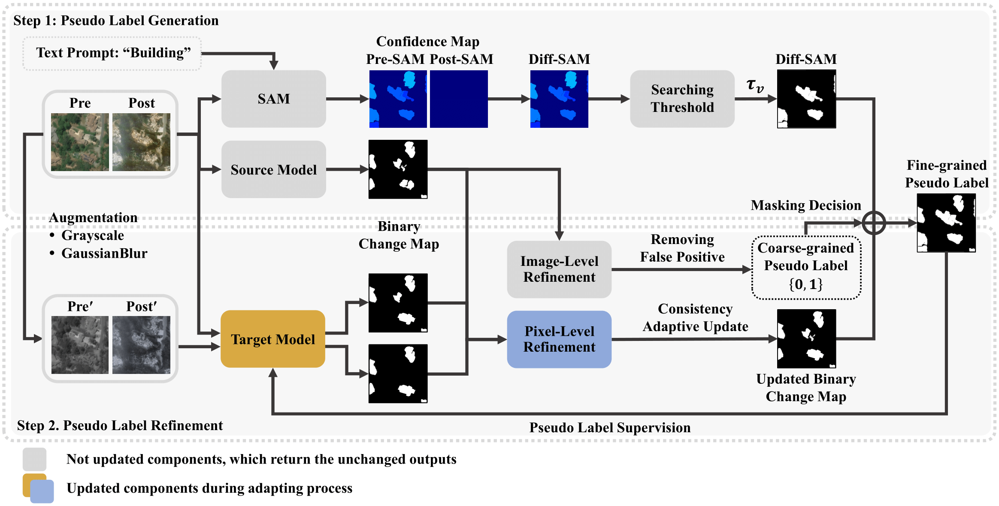
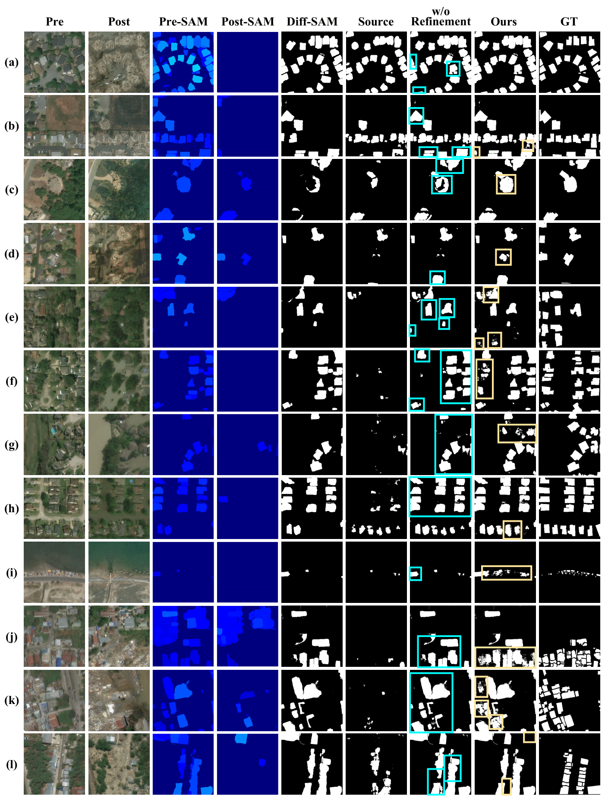
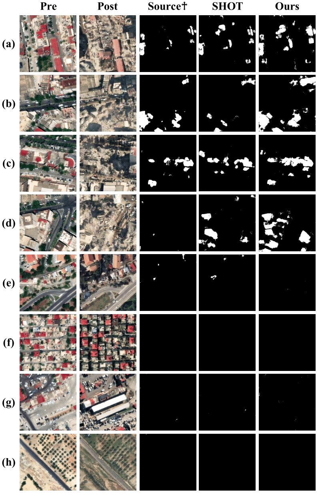

# DAVI (Disaster Assessment with VIsion foundation model)

This project is for Change Detection (CD) in unsupervised setting. 

The increasing frequency and intensity of natural disasters demand more sophisticated approaches for rapid and precise damage assessment. 
To tackle this issue, researchers have developed various methods on disaster benchmark datasets from satellite imagery to aid in detecting disaster damage. 
However, the diverse nature of geographical landscapes and disasters makes it challenging to apply existing methods to regions unseen during training. 
We present DAVI (Disaster Assessment with VIsion foundation model), which overcomes domain disparities and detects structural damage (e.g., building) without requiring ground-truth labels of target regions. 
DAVI integrates task-specific knowledge from a model trained on source regions with an image segmentation foundation model to generate pseudo labels of possible damage in target regions. 
It then employs a two-stage refinement process, targeting both the pixel and overall image, to more accurately pinpoint changes in disaster-struck areas based on before-and-after images. 
Comprehensive evaluations, including a case study on a recent disaster, demonstrate that DAVI achieves exceptional performance across diverse terrains (e.g., USA, Indonesia, and Türkiye) and disaster types (e.g., wildfires, hurricanes, tsunamis, and earthquakes). 
This confirms its robustness in assessing disaster impact without relying on ground-truth labels and emphasizes its practical applicability.

## Pipeline

<div style="width: 80%; height: 80%">
  
  
  
</div>

## Instruction

### Installation

- Use a virtual environment

```bash
conda create -n PROJECT_NAME python=3.8
conda activate PROJECT_NAME
```

- Install packages

```bash
pip install -r requirements.txt
```

### Dataset

We evaluate the proposed network on benchmark dataset, xBD. 
xBD is the largest building damage assessment dataset to date, containing ~700,000 building annotations across over 5,000 km^2 of imagery from 15 countries.
Create a `dataset` folder under the ROOT directory, then download the dataset from [xBD]([https://filebox.ece.vt.edu/~ylzou/summer2020pseudoseg/pascal_voc_seg.tar](https://xview2.org/dataset)), and extract them in `dataset` folder.


### Training

**NOTE:** 
- We train all our models using single V100 GPU.

#### Run

```bash
python main.py \
  --backbone='Siam-NestedUNet' \
  --epochs=50 \
  --batch_size=8 \
  --learning_rate=1e-5 \
  --dataset='xBD' \
  --dataset_dir='./dataset' \
  --source_disaster='palu-tsunami' \
  --target_disaster='palu-tsunami' \
  --loss_opt=1 \
  --coarse_filter=True \
  --gt_filter=False \
  --sam=True \
  --add_source=True \
  --hard_threshold=0.1
```

## Results

We provide an additional qualitative analysis of the impact of each component within the proposed method on wildfires, hurricanes, and tsunamis.
The rows are as follows: (a-d) Wildfires (California, USA); (e-h) Hurricanes (Texas, USA); (i-l) Tsunamis (Sulawesi, Indonesia). Cases that benefits from image segmentation foundation model are highlighted with the blue box; Cases that benefits from refinement process are highlighted with the yellow box.

<div style="width: 70%; height: 70%">
  
  
  
</div>

## Case Study

We present representative cases and their evaluation results using the 2023 Türkiye earthquake dataset, freely provided by Maxar, to demonstrate our method's applicability to recent real-world disasters.
This dataset includes 1,648 pairs of pre- and post-disaster images.

<div align="center"; style="width: 60%; height: 60%">
  
  
  
</div>
